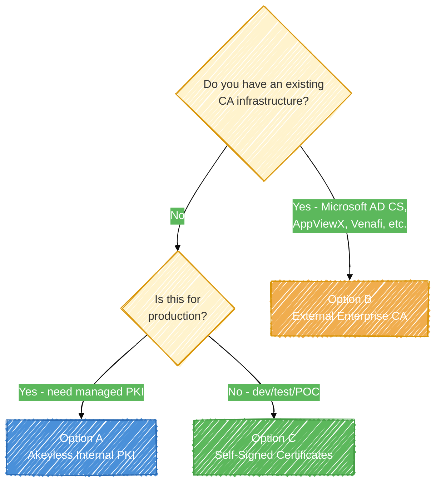
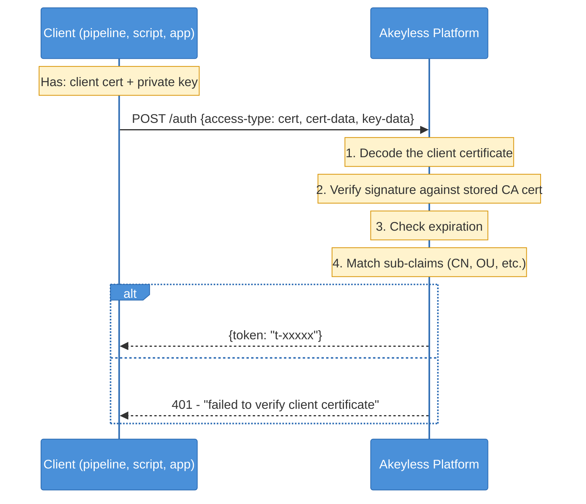
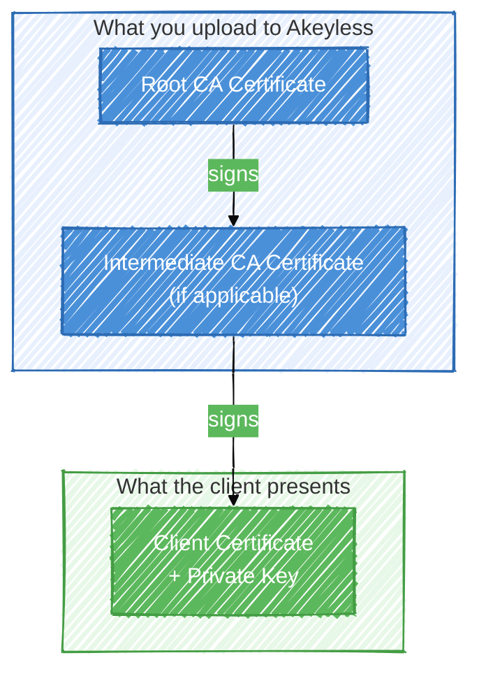
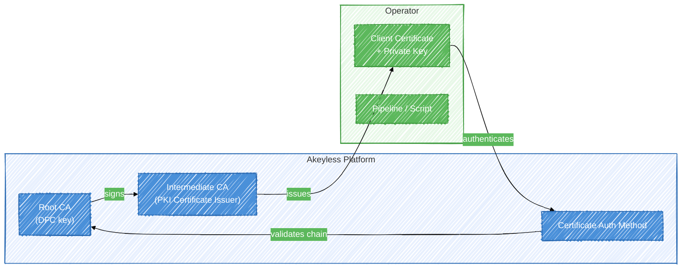
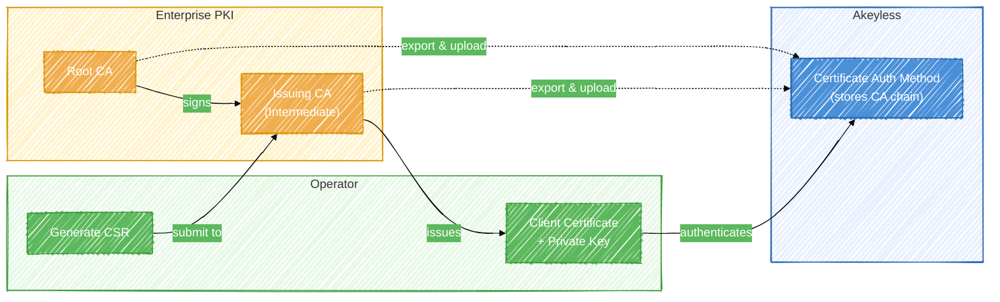

# Certificate Authentication for Akeyless

A complete guide to setting up certificate-based authentication with Akeyless. Certificate auth lets machines and pipelines authenticate to Akeyless by presenting a signed client certificate instead of a static API key - no secrets to rotate, no keys to leak.

This guide covers three approaches depending on your PKI infrastructure. Use the decision tree below to pick the right one, then follow the step-by-step instructions.



| Approach | When to use | CA managed by |
|----------|-------------|---------------|
| [Option A: Akeyless Internal PKI](#option-a-akeyless-internal-pki) | You don't have an existing PKI, or you want Akeyless to manage the full chain | Akeyless |
| [Option B: External Enterprise CA](#option-b-external-enterprise-ca) | You have Microsoft AD CS, AppViewX, Venafi, or another enterprise CA | Your PKI team |
| [Option C: Self-Signed Certificates](#option-c-self-signed-certificates) | Dev/test environments, quick POCs | You (openssl/mkcert) |

---

## Table of Contents

1. [How Certificate Auth Works](#how-certificate-auth-works)
2. [The Chain of Trust](#the-chain-of-trust)
3. [Option A: Akeyless Internal PKI](#option-a-akeyless-internal-pki)
4. [Option B: External Enterprise CA](#option-b-external-enterprise-ca)
5. [Option C: Self-Signed Certificates](#option-c-self-signed-certificates)
6. [Create the Auth Method in Akeyless](#create-the-auth-method-in-akeyless)
7. [Test Authentication](#test-authentication)
8. [Using Certificate Auth in Pipelines](#using-certificate-auth-in-pipelines)
9. [Troubleshooting](#troubleshooting)

---

## How Certificate Auth Works

When a client authenticates to Akeyless with a certificate, Akeyless does not call out to your CA or check a CRL in real time. Instead, it validates the client certificate locally against the CA certificate you uploaded when you created the auth method. The entire trust relationship is established at setup time.



Akeyless checks four things during certificate authentication:

| Check | What it verifies | Common failure |
|-------|-----------------|----------------|
| **Signature chain** | The client cert was signed by the CA cert you uploaded (or by an intermediate whose chain leads to that CA) | Uploaded only the root CA but the client cert was signed by an intermediate - you need to upload the full chain |
| **Expiration** | The client cert is not expired and the `notBefore` date has passed | Certificate expired or clock skew between systems |
| **Key usage** | The client cert has `clientAuth` in its Extended Key Usage | Certificate was issued for `serverAuth` only (common with TLS server certs) |
| **Sub-claims** | Optional constraints on CN, OU, DNS SANs, etc. configured on the auth method | CN in the cert doesn't match the sub-claim pattern |

> **Key point:** Akeyless does not need to be your CA. It does not need to issue the client certificate. It only needs a copy of the CA certificate (or intermediate chain) that signed the client certificate, so it can verify the signature. Your CA can be anything - Microsoft AD CS, AppViewX, Venafi, Let's Encrypt, HashiCorp Vault PKI, or a self-signed root you generated with openssl.

### Do I need to build a chain of trust in Akeyless?

No. The Akeyless documentation mentions "Build your Chain of Trust" as one option for organizations that don't already have a PKI. This leads to a common misunderstanding: that Akeyless must act as your CA before certificate auth will work. That is not the case.

Here is how certificate auth actually works, depending on your starting point:

| Your situation | What to do | Do you need Akeyless PKI? |
|----------------|-----------|--------------------------|
| You have an enterprise CA (Microsoft AD CS, AppViewX, Venafi, etc.) | Export the CA chain, upload it to the Akeyless auth method, issue a client cert from your CA | **No.** Go to [Option B](#option-b-external-enterprise-ca). |
| You don't have any PKI and want Akeyless to manage it | Use Akeyless to create a root CA, intermediate CA, and issue client certs | **Yes, this is the one case where you use it.** Go to [Option A](#option-a-akeyless-internal-pki). |
| You want a quick setup for dev/test | Generate a self-signed CA and client cert with openssl | **No.** Go to [Option C](#option-c-self-signed-certificates). |
| You have a self-signed certificate (no CA at all) | A single self-signed cert acts as both the CA and the client cert. Upload it to the auth method and present it during auth. | **No.** See the note in [Option C](#option-c-self-signed-certificates). |

The "Build your Chain of Trust" path in the Akeyless docs is Option A above - it creates a DFC-protected root key inside Akeyless and uses it to sign an intermediate CA that issues client certificates. This is a convenience feature for organizations without existing PKI, not a prerequisite for certificate auth.

If you already have a CA that issues certificates, you do not need to create anything in Akeyless beyond the auth method itself. Export your CA's certificate chain, upload it, and you're done.

---

## The Chain of Trust

Certificate authentication relies on a chain of trust. The client presents a certificate, and Akeyless walks the chain back to a CA it recognizes. How that chain is built depends on your PKI setup.



### With an intermediate CA (most enterprise setups)

When your organization uses an intermediate CA (which is the standard practice for Microsoft AD CS, AppViewX, Venafi, and most enterprise PKI), you need to upload the **full chain** to Akeyless - not just the root CA.

```
Root CA  --->  Intermediate CA  --->  Client Certificate
  ^                ^                       ^
  |                |                       |
  Upload both     Upload both         Client presents
  to Akeyless     to Akeyless         this + private key
```

Concatenate them into a single PEM file (order matters - leaf-to-root):

```bash
cat intermediate-ca.pem root-ca.pem > ca-chain.pem
```

### Without an intermediate (self-signed or simple PKI)

```
Root CA  --->  Client Certificate
  ^                 ^
  |                 |
  Upload to         Client presents
  Akeyless          this + private key
```

Upload just the root CA certificate.

---

## Option A: Akeyless Internal PKI

Use this when you want Akeyless to manage the entire certificate lifecycle - root CA, intermediate CA, and client certificate issuance. This is the simplest path if you don't have an existing PKI.



### A.1 Create a Root CA key with self-signed certificate

This creates a DFC-protected RSA key and a self-signed root CA certificate in a single step. The private key never leaves Akeyless.

```bash
akeyless create-dfc-key \
  --name "/PKI/CertAuth/RootCA" \
  --alg RSA2048 \
  --generate-self-signed-certificate true \
  --certificate-ttl 3650
```

> `--certificate-ttl` is in **days** (not seconds). `3650` = 10 years. Adjust based on your security policy.

> **Note:** The self-signed certificate generated by `create-dfc-key` uses empty subject fields by default. This is fine for the root CA - the subject does not affect certificate auth validation. If you need a specific CN/O in the certificate, generate a CSR separately and self-sign it.

Export the root CA certificate:

```bash
akeyless describe-item --name "/PKI/CertAuth/RootCA" --json | jq -r '.certificates' > root-ca.pem
```

> **Important:** Do not use `get-rsa-public` - that exports the raw public key, not the X.509 certificate. The auth method needs the certificate.

### A.2 Create a PKI Certificate Issuer (Intermediate CA)

The certificate issuer signs client certificates. It acts as an intermediate CA chained to the root.

```bash
akeyless create-pki-cert-issuer \
  --name "/PKI/CertAuth/IntermediateCA" \
  --signer-key-name "/PKI/CertAuth/RootCA" \
  --ttl 31536000 \
  --allowed-domains "example.com,*.example.com" \
  --allow-any-name true \
  --client-flag true \
  --server-flag false \
  --key-usage "DigitalSignature,KeyEncipherment" \
  --organization-units "DevOps"
```

Key parameters:

| Parameter | Purpose |
|-----------|---------|
| `--signer-key-name` | The root CA key from step A.1 |
| `--client-flag true` | Ensures issued certs include `clientAuth` extended key usage (required) |
| `--server-flag false` | Don't include `serverAuth` - these are client certs, not TLS server certs |
| `--allow-any-name true` | Allow any CN/SAN - tighten this in production |
| `--ttl` | Max lifetime of issued certificates (seconds). `31536000` = 1 year |
| `--organization-units` | OU to embed in issued certs - useful for sub-claim matching |

### A.3 Issue a client certificate

> **Important:** Always generate the private key separately and save it to a file. The inline approach (generating the key inside the command) discards the private key - you will have a signed certificate with no way to use it.

```bash
# Generate a private key
openssl genpkey -algorithm RSA -pkeyopt rsa_keygen_bits:2048 -out client-key.pem

# Request the certificate from Akeyless
akeyless get-pki-certificate \
  --cert-issuer-name "/PKI/CertAuth/IntermediateCA" \
  --key-data-base64 "$(base64 -w0 client-key.pem)" \
  --common-name "pipeline-client" \
  --ttl 2592000 \
  > client-cert.pem
```

> **TTL:** `2592000` seconds = 30 days. In production, use short-lived certificates and automate renewal. On **macOS**, use `base64 -b 0` instead of `base64 -w0`.

### A.4 Verify and prepare for auth method creation

The `get-pki-certificate` output from step A.3 includes both the leaf certificate and the intermediate CA chain in a single PEM file. Akeyless validates client certificates against the root CA certificate you upload to the auth method.

```bash
# Verify the client cert file contains the leaf + chain
grep -c "BEGIN CERTIFICATE" client-cert.pem
# Expected: 2 (leaf cert + intermediate CA cert)

# Verify the chain validates against the root CA
openssl verify -CAfile root-ca.pem client-cert.pem
# Expected: client-cert.pem: OK
```

For the auth method, upload `root-ca.pem` (the root CA certificate exported in step A.1).

You now have:
- `ca-chain.pem` - the CA chain (upload to Akeyless auth method)
- `client-cert.pem` - the client certificate (used by pipelines)
- `client-key.pem` - the client private key (used by pipelines)

Skip to [Create the Auth Method in Akeyless](#create-the-auth-method-in-akeyless).

---

## Option B: External Enterprise CA

Use this when your organization already has a PKI infrastructure - Microsoft Active Directory Certificate Services (AD CS), AppViewX, Venafi Trust Protection Platform, EJBCA, or any CA that issues X.509 certificates.



Akeyless does not need to connect to your CA. You export the CA certificates once and upload them. From that point, any client certificate signed by that CA (or its intermediates) can authenticate.

### B.1 Export the CA chain from your enterprise PKI

You need the CA certificate chain in PEM format. The process varies by platform:

#### Microsoft AD CS

```powershell
# Export the root CA certificate (run on the root CA server, or specify -config)
certutil -config "RootCA-Server\Root-CA" -ca.cert root-ca.cer

# Export the issuing (intermediate) CA certificate
certutil -config "IssuingCA-Server\Issuing-CA" -ca.cert intermediate-ca.cer

# Or export from the Certification Authority MMC snap-in:
# Right-click the CA > Properties > View Certificate > Details > Copy to File > Base-64 encoded X.509
```

> **Note:** Replace `RootCA-Server\Root-CA` and `IssuingCA-Server\Issuing-CA` with your actual CA server hostname and CA name. Run `certutil -config - -ping` to list available CAs on the network.

`certutil` exports in DER format by default. Convert to PEM:

```bash
openssl x509 -in certificate.cer -inform DER -out certificate.pem -outform PEM
```

#### AppViewX

1. Navigate to **Certificate Management > CA Certificates**
2. Select your Root CA and Issuing CA
3. Export each in PEM format
4. If AppViewX is acting as an RA (Registration Authority) in front of Microsoft AD CS, export the AD CS root and intermediate - those are the actual signing CAs

#### Venafi Trust Protection Platform

```bash
# Using the Venafi CLI (vcert)
vcert getcred --url https://tpp.example.com --trust-bundle ca-chain.pem
```

Or export from the Venafi web UI under **Policy > CA Templates**.

#### Generic / Other CAs

The files you need are the same regardless of platform:

| File | What it is | Where to find it |
|------|-----------|------------------|
| `root-ca.pem` | Root CA certificate | Your PKI team, or exported from the CA server |
| `intermediate-ca.pem` | Issuing/Intermediate CA certificate | Your PKI team, or exported from the CA server |

### B.2 Build the CA chain file

Concatenate the certificates into a single PEM file. Order: **intermediate first, root last**.

```bash
cat intermediate-ca.pem root-ca.pem > ca-chain.pem
```

Verify the chain file contains both certificates:

```bash
# Should print 2
grep -c "BEGIN CERTIFICATE" ca-chain.pem
```

### B.3 Generate a CSR and get it signed

Generate a private key and Certificate Signing Request (CSR):

```bash
openssl req -new -newkey rsa:2048 -nodes \
  -keyout client-key.pem \
  -out client.csr \
  -subj "/CN=akeyless-pipeline/OU=DevOps/O=YourOrg"
```

> **Important:** Include the `clientAuth` extended key usage. Add this to your openssl config or request it from your CA when submitting the CSR. Without `clientAuth`, Akeyless will reject the certificate with "failed to verify client certificate."

For Microsoft AD CS, submit the CSR using `certreq`:

```powershell
certreq -submit -config "CA-Server\Issuing-CA" -attrib "CertificateTemplate:YourClientAuthTemplate" client.csr client-cert.cer
```

> **Template name:** Replace `YourClientAuthTemplate` with the display name of a certificate template on your CA that includes the Client Authentication EKU. Common names: `ClientAuth`, `Workstation Authentication`, or a custom template your PKI team created.

> **Output format:** `certreq` outputs DER by default. Convert to PEM: `openssl x509 -in client-cert.cer -inform DER -out client-cert.pem -outform PEM`

For AppViewX, submit via the AppViewX portal under **Certificate Management > Enroll Certificate**, select the client authentication template, and paste the CSR.

For other CAs, follow your standard certificate request process. The key requirement is:

| Requirement | Why |
|-------------|-----|
| **Extended Key Usage: clientAuth** | Akeyless checks for this. Server-only certs will be rejected. |
| **PEM format** | Akeyless expects PEM-encoded certificates, not DER/PKCS12 |
| **RSA 2048+ or EC P-256+** | Minimum key strength |

### B.4 Verify the client certificate

Before uploading anything to Akeyless, verify that the client cert is signed by your CA chain:

```bash
openssl verify -CAfile ca-chain.pem client-cert.pem
```

Expected output: `client-cert.pem: OK`

If this fails, Akeyless authentication will also fail. Fix the chain before proceeding.

Check that `clientAuth` is present:

```bash
# OpenSSL 1.1.1+
openssl x509 -in client-cert.pem -noout -ext extendedKeyUsage

# OpenSSL 1.0.x / LibreSSL (macOS default)
openssl x509 -in client-cert.pem -noout -text | grep -A1 "Extended Key Usage"
```

Expected output should include `TLS Web Client Authentication`.

You now have:
- `ca-chain.pem` - the CA chain (upload to Akeyless auth method)
- `client-cert.pem` - the client certificate (used by pipelines)
- `client-key.pem` - the client private key (used by pipelines)

Skip to [Create the Auth Method in Akeyless](#create-the-auth-method-in-akeyless).

---

## Option C: Self-Signed Certificates

Use this for development, testing, and POC environments where you don't need an enterprise CA.

> **This is not the same as using Akeyless as the CA.** Here you generate everything locally with openssl. The certificates are not managed by any CA infrastructure.

There are two variants:

- **C-1: Self-signed CA + client cert** (recommended) - you create a local CA and use it to sign a separate client certificate. This mirrors how production PKI works and lets you issue multiple client certs from the same CA.
- **C-2: Single self-signed cert** - the same certificate is both the CA and the client. Upload it to the auth method and present it during authentication. This works but means each client needs its own auth method entry, so it doesn't scale.

The steps below cover variant C-1. For variant C-2 (single self-signed cert acting as both CA and client):

```bash
# Generate key + self-signed cert with clientAuth in one step
openssl req -x509 -newkey rsa:2048 -nodes \
  -keyout client-key.pem -out client-cert.pem -days 365 \
  -subj "/CN=pipeline-client/OU=DevOps" \
  -addext "extendedKeyUsage=clientAuth"
# Note: -addext requires OpenSSL 1.1.1+. On older versions, use -extfile instead.

# Use the same cert as both the CA and client cert
# Upload client-cert.pem as the CA in the auth method
# Present client-cert.pem + client-key.pem during authentication
```

Then skip to [Create the Auth Method in Akeyless](#create-the-auth-method-in-akeyless), using `client-cert.pem` in place of `ca-chain.pem`.

### C.1 Generate a self-signed CA

```bash
# Generate CA private key
openssl genpkey -algorithm RSA -pkeyopt rsa_keygen_bits:2048 -out ca-key.pem

# Generate self-signed CA certificate (10-year validity)
openssl req -new -x509 -key ca-key.pem -out ca-cert.pem -days 3650 \
  -subj "/CN=Akeyless Dev CA/O=DevOps"
```

> **Protect `ca-key.pem`.** This is the trust anchor for your auth method. Anyone with this key can generate client certificates that authenticate to Akeyless. Store it offline or in a secrets manager - do not leave it in your working directory, commit it to git, or include it in container images. The `.gitignore` in this repo excludes `*.pem` files, but git is not the only way keys get leaked.

### C.2 Generate a client certificate signed by this CA

```bash
# Generate client private key
openssl genpkey -algorithm RSA -pkeyopt rsa_keygen_bits:2048 -out client-key.pem

# Generate CSR
openssl req -new -key client-key.pem -out client.csr \
  -subj "/CN=pipeline-client/OU=DevOps"

# Create an extensions file for clientAuth EKU
echo "extendedKeyUsage=clientAuth" > client-ext.cnf

# Sign the CSR with the CA (1-year validity, with clientAuth)
openssl x509 -req -in client.csr \
  -CA ca-cert.pem -CAkey ca-key.pem -CAcreateserial \
  -out client-cert.pem -days 365 \
  -extfile client-ext.cnf

rm client-ext.cnf
```

### C.3 Verify

```bash
openssl verify -CAfile ca-cert.pem client-cert.pem
# Expected: client-cert.pem: OK

openssl x509 -in client-cert.pem -noout -ext extendedKeyUsage
# Expected: TLS Web Client Authentication
```

You now have:
- `ca-cert.pem` - the CA certificate (upload to Akeyless auth method)
- `client-cert.pem` - the client certificate (used by pipelines)
- `client-key.pem` - the client private key (used by pipelines)

---

## Create the Auth Method in Akeyless

This step is the same regardless of which CA option you used above. You need the CA certificate (or chain) in PEM format.

### Using the Akeyless CLI

```bash
akeyless auth-method create cert \
  --name "/Auth/CertificateAuth" \
  --unique-identifier "common_name" \
  --certificate-data "$(base64 -w0 ca-chain.pem)"
```

| Parameter | Description |
|-----------|-------------|
| `--name` | Path in Akeyless for this auth method |
| `--unique-identifier` | Which certificate field to use as the identity. Options: `common_name`, `organization`, `organizational_unit`, `dns_sans`, `email_sans`, `uri_sans` |
| `--certificate-data` | Base64-encoded CA certificate (or chain). This is what Akeyless validates client certs against. |

The `--unique-identifier` determines what shows up in audit logs and can be used in sub-claims for RBAC. For most setups, `common_name` is the right choice.

### Using the Akeyless Console

1. Navigate to **Auth Methods** in the left sidebar
2. Click **New** > **Certificate**
3. Fill in:
   - **Name:** A descriptive path like `/Auth/CertificateAuth`
   - **Certificate:** Paste the contents of your CA PEM file (or chain)
   - **Unique Identifier:** Select `common_name`
4. Click **Save**

### Add sub-claims (optional but recommended)

Sub-claims restrict which client certificates can authenticate. Without sub-claims, any certificate signed by the uploaded CA will be accepted.

```bash
akeyless auth-method update cert \
  --name "/Auth/CertificateAuth" \
  --bound-common-names "pipeline-client,akeyless-*" \
  --bound-organizational-units "DevOps"
```

| Sub-claim | Restricts authentication to certificates with... |
|-----------|--------------------------------------------------|
| `--bound-common-names` | CN matching one of these values (supports `*` wildcards) |
| `--bound-organizational-units` | OU matching one of these values |
| `--bound-dns-sans` | DNS SANs matching one of these values |
| `--bound-uri-sans` | URI SANs matching one of these values |
| `--bound-extensions` | Specific X.509 extensions |

### Associate with an Access Role

The auth method has no permissions by default. Associate it with a role:

```bash
# Create a role (if you don't have one)
akeyless create-role --name "/Roles/PipelineRole"

# Grant permissions on a path
akeyless set-role-rule \
  --role-name "/Roles/PipelineRole" \
  --path "/Ansible/Credentials/*" \
  --capability read \
  --capability list

# Associate the auth method with the role
akeyless assoc-role-am \
  --role-name "/Roles/PipelineRole" \
  --am-name "/Auth/CertificateAuth" \
  --sub-claims "common_name=pipeline-client"
```

The `--sub-claims` on the role association is an additional filter beyond the auth method's bound claims. A client must match both the auth method's bounds and the role association's sub-claims to get that role's permissions.

Note the **access ID** printed when the auth method was created (it starts with `p-`). You'll need this to authenticate.

```bash
# Find the access ID for an existing auth method
akeyless list-auth-methods --json | \
  jq -r '.auth_methods[] | select(.auth_method_name == "/Auth/CertificateAuth") | .auth_method_access_id'
```

---

## Test Authentication

### CLI

```bash
akeyless auth \
  --access-id "p-xxxxxxxxxx" \
  --access-type cert \
  --cert-file-name client-cert.pem \
  --key-file-name client-key.pem
```

Expected output: a token starting with `t-`.

### REST API (curl)

```bash
TOKEN=$(curl -sf -X POST "https://api.akeyless.io/auth" \
  -H "Content-Type: application/json" \
  -d "{
    \"access-id\": \"p-xxxxxxxxxx\",
    \"access-type\": \"cert\",
    \"cert-data\": \"$(base64 -w0 client-cert.pem)\",
    \"key-data\": \"$(base64 -w0 client-key.pem)\"
  }" | jq -r '.token')

echo "Token: ${TOKEN:0:20}..."
```

### Verify the token works

```bash
akeyless list-items --path "/Ansible/" --token "$TOKEN"
```

---

## Using Certificate Auth in Pipelines

### Environment variables

```bash
export AKEYLESS_ACCESS_ID="p-xxxxxxxxxx"
export AKEYLESS_CERT_DATA=$(base64 -w0 /path/to/client-cert.pem)
export AKEYLESS_KEY_DATA=$(base64 -w0 /path/to/client-key.pem)
```

> **`base64 -w0`** is critical. The `-w0` flag disables line wrapping. Without it, the base64 output contains newlines that break the JSON payload when passed to the API. On **macOS**, use `base64 -b 0` instead - macOS does not support the `-w` flag.

### GitHub Actions

Store the base64 values as repository secrets, then use them in your workflow:

```yaml
env:
  AKEYLESS_ACCESS_ID: ${{ secrets.AKEYLESS_ACCESS_ID }}
  AKEYLESS_CERT_DATA: ${{ secrets.AKEYLESS_CERT_DATA }}
  AKEYLESS_KEY_DATA: ${{ secrets.AKEYLESS_KEY_DATA }}
```

### Ansible

```yaml
- name: Authenticate to Akeyless
  akeyless.secrets_management.login:
    akeyless_api_url: "https://api.akeyless.io"
    access_id: "{{ akeyless_access_id }}"
    access_type: "cert"
    cert_file_name: "{{ akeyless_cert_file }}"
    key_file_name: "{{ akeyless_key_file }}"
  register: akeyless_auth
  no_log: true
```

---

## Troubleshooting

### "failed to verify client certificate (signer or expiration)"

This is the most common error. It means Akeyless could not validate the signature chain from the client certificate back to the CA certificate you uploaded.

| Cause | How to check | Fix |
|-------|-------------|-----|
| **Incomplete chain** - uploaded root CA only, but client cert was signed by an intermediate | `openssl verify -CAfile ca-chain.pem client-cert.pem` returns an error about unable to get local issuer | Upload the full chain: `cat intermediate-ca.pem root-ca.pem > ca-chain.pem` and update the auth method (see below) |
| **Wrong CA uploaded** - the auth method has a different CA than the one that signed the client cert | `openssl x509 -in ca-chain.pem -noout -issuer` doesn't match the client cert's issuer | Export the correct CA certificate from your PKI and re-upload (see below) |

To update an existing auth method's CA certificate:

```bash
akeyless auth-method update cert \
  --name "/Auth/CertificateAuth" \
  --certificate-data "$(base64 -w0 ca-chain.pem)"
```
| **Client cert expired** | `openssl x509 -in client-cert.pem -noout -dates` shows `notAfter` in the past | Issue a new client certificate |
| **CA cert expired** | `openssl x509 -in ca-cert.pem -noout -dates` shows `notAfter` in the past | Renew the CA certificate and update the auth method |
| **DER format instead of PEM** | `file client-cert.pem` shows "data" instead of "PEM certificate" | Convert: `openssl x509 -in cert.cer -inform DER -out cert.pem -outform PEM` |

### "access authentication failed" (401 with no details)

Check the Akeyless audit log for the session ID in the error URL. Common causes:

| Cause | Fix |
|-------|-----|
| Wrong `access-id` | Use the access ID from the cert auth method (`p-xxxxx`), not a different auth method |
| Auth method has no role association | Run `akeyless assoc-role-am` to associate a role |
| Sub-claim mismatch | The client cert's CN/OU doesn't match the `--bound-common-names` or `--bound-organizational-units` on the auth method or role association |

### "missing clientAuth key usage"

The client certificate was issued without the `clientAuth` extended key usage.

```bash
# Check what key usage is present
openssl x509 -in client-cert.pem -noout -ext extendedKeyUsage
```

If it shows only `TLS Web Server Authentication` (or nothing), you need to reissue the certificate with `clientAuth` enabled:

- **Microsoft AD CS:** Use a certificate template that includes "Client Authentication" in the Application Policies
- **AppViewX:** Select a template with Client Authentication EKU
- **Akeyless PKI:** Set `--client-flag true` on the certificate issuer
- **openssl:** Create a file with `echo "extendedKeyUsage=clientAuth" > ext.cnf` and add `-extfile ext.cnf` when signing

### "certificate is not in PEM format"

Akeyless expects PEM-encoded certificates. If you exported from a Windows CA, you likely have DER or PKCS12 format.

```bash
# Convert DER to PEM
openssl x509 -in cert.cer -inform DER -out cert.pem -outform PEM

# Extract cert and key from PKCS12 (.pfx/.p12)
openssl pkcs12 -in cert.pfx -out client-cert.pem -clcerts -nokeys
openssl pkcs12 -in cert.pfx -out client-key.pem -nocerts -nodes
```

### Quick diagnostic script

Run this to validate your certificates before configuring Akeyless:

```bash
#!/usr/bin/env bash
set -euo pipefail

CA_CERT="${1:-ca-chain.pem}"
CLIENT_CERT="${2:-client-cert.pem}"
CLIENT_KEY="${3:-client-key.pem}"

echo "=== CA Certificate ==="
openssl x509 -in "$CA_CERT" -noout -subject -issuer -dates 2>&1 || echo "FAIL: Cannot read CA cert"

echo ""
echo "=== Client Certificate ==="
openssl x509 -in "$CLIENT_CERT" -noout -subject -issuer -dates 2>&1 || echo "FAIL: Cannot read client cert"

echo ""
echo "=== Chain Verification ==="
openssl verify -CAfile "$CA_CERT" "$CLIENT_CERT" 2>&1

echo ""
echo "=== Key Usage ==="
EKU=$(openssl x509 -in "$CLIENT_CERT" -noout -ext extendedKeyUsage 2>&1)
if echo "$EKU" | grep -q "Client Authentication"; then
  echo "PASS: clientAuth present"
else
  echo "FAIL: clientAuth missing - Akeyless will reject this certificate"
  echo "$EKU"
fi

echo ""
echo "=== Key Match ==="
CERT_PUB=$(openssl x509 -in "$CLIENT_CERT" -noout -pubkey 2>/dev/null | openssl dgst -md5)
KEY_PUB=$(openssl pkey -in "$CLIENT_KEY" -pubout 2>/dev/null | openssl dgst -md5)
if [ "$CERT_PUB" = "$KEY_PUB" ]; then
  echo "PASS: Private key matches certificate"
else
  echo "FAIL: Private key does not match certificate"
fi
```

Save as `verify-certs.sh` and run:

```bash
bash verify-certs.sh ca-chain.pem client-cert.pem client-key.pem
```

All checks should pass before you configure the Akeyless auth method.
